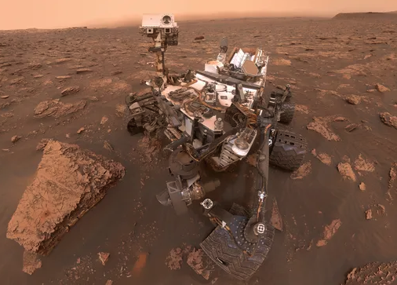
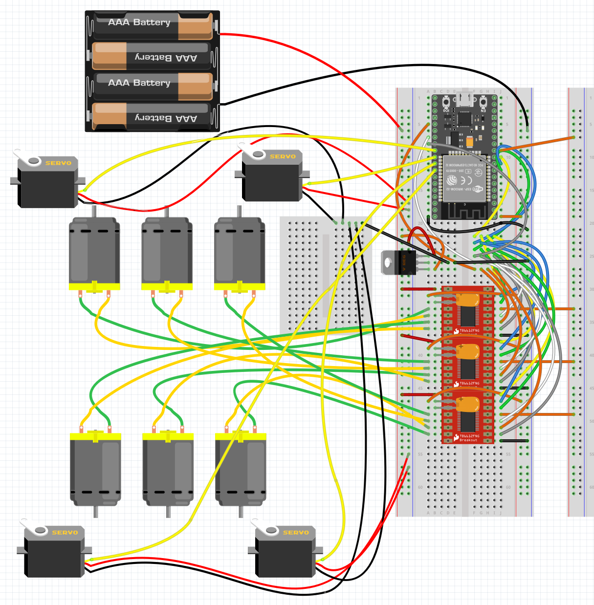

# Curiosity-Rover

    

## Goal
###
I want to drive around a highly functional model of the Mars Science Laboratory (MSL), named [Curiosity](https://www.jpl.nasa.gov/missions/mars-science-laboratory-curiosity-rover-msl/).  It will have working rocker-bogie suspension, and 4 steerable motors so it can spin in place without skid steering like a tank.  I'm making it as small as I can using [Sanyo-style micro gearmotors](https://www.amazon.com/gp/aw/d/B07FVMVGM3/?_encoding=UTF8), which are inexpensive, strong, and fairly small.  The motors have to fit inside the wheel hubs and the steering mechanism without altering the proportions of the model too much for my taste.  Therefore the smallest I can make it is 1/6 scale, I could go smaller but it would mean more expensive smaller motors.

## Wiring
###
Using [Fritzing](https://fritzing.org/), a companion project of the [Arduino](https://www.arduino.cc/) movement, to document the physical orientation of all the wires that I'm putting in this thing.  You can draw wires, place components in solderless breadboards, all visually and intuitively while you make real connections on your project.  It generates schematics and node trees that can be used to order real PCB's to build the project more permanently.

    

## Hardware
### Controller
[ESP32 Devkit](https://www.microcenter.com/product/613822/inland-esp32-wroom-32d-module) as a central controller has many input-output pins, nearly all of which can do motor controlling functions like PWM.  This is vital when it needs 10 independent motors just to drive around.  The ESP32 also has WiFi and Bluetooth built in, providing an inexpensive method of remote control.
### Interface
Uses standard web page interface, served via access point protocol. Open your phone, tablet or desktop computer and log into "curiosity".  The password is "callyourmom".  Then open a browser to "controller.local" and the control UI will show up, allowing you to control the rover.

### Motors
[Sanyo-style micro gearmotors](https://www.amazon.com/gp/aw/d/B07FVMVGM3/?_encoding=UTF8) provide the traction and steering functions of the model.  They may even provide animation of the [Mast Camera](https://science.nasa.gov/mission/msl-curiosity/science-instruments/#h-mastcam) and Robotic Arm, but that is a project more complex than just driving the model around.

### Motor Driver
[DRV8833 H-Bridges](https://www.amazon.com/VKLSVAN-DRV8833-h-Bridge-Arduino-Microcontroller/dp/B0DQGQ1V1C) provide control of 2 motors per module, so there will be 3 of these on the model for driving.

### 10k Potentiometers
[Potentiometers](https://www.amazon.com/Taiss-Potentiometer-Variable-Resistors-Terminals/dp/B09XDR799P) are often used as volume controls.  I'm using them as a position sensor for the steerable wheels.  They convert an angle of the steering bracket into a voltage, which can be a feedback signal for standard hobby servo motor PCB's.

### Code Acknowledgements
- [Arduino platform](https://www.arduino.cc/) for their wonderful hardware & programming environment, start here if you want to build anything but don't know how to do any of it.
- [Fritzing GmbH](https://fritzing.org/) for their wiring schematic and PCB generation platform.
- [ESPRESSIF](https://www.espressif.com/en/producttype/esp32-wroom-32) a Chinese organization known for their superb wireless hardware, with software examples that are easily used in Arduino or standalone.
- [ARM Limited, et al.](https://github.com/littlefs-project/littlefs) simplifies putting the resources for the web app on the ESP32.
- [me-no-dev and Lacamera](https://github.com/lacamera/ESPAsyncWebServer) for their ESP WebServer, making it a trivial task to have a web browser serve your web application.
- [Rui Santos & Sara Santos Random Nerd Tutorials](https://RandomNerdTutorials.com/esp32-websocket-server-sensor/) for their websocket demo for ESP32 and Web, enabling real-time control from the app to the rover.
- [Yoann Moinet](https://github.com/yoannmoinet/nipplejs) for his ephemeral and intuitive joystick library "NippleJS".
- [Kevin Harrington and John K. Bennet](https://madhephaestus.github.io/ESP32Servo/annotated.html) for their ESP32 compatible PWM library, I couldn't make the default Espressif implementation work.
- [Benoit Blanchon](https://arduinojson.org/?utm_source=meta&utm_medium=library.properties) for his ArduinoJson library, making the two-way communication protocal simple, and transferrable across web, wifi and http.
